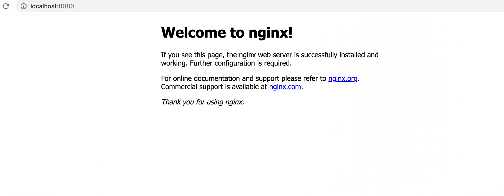
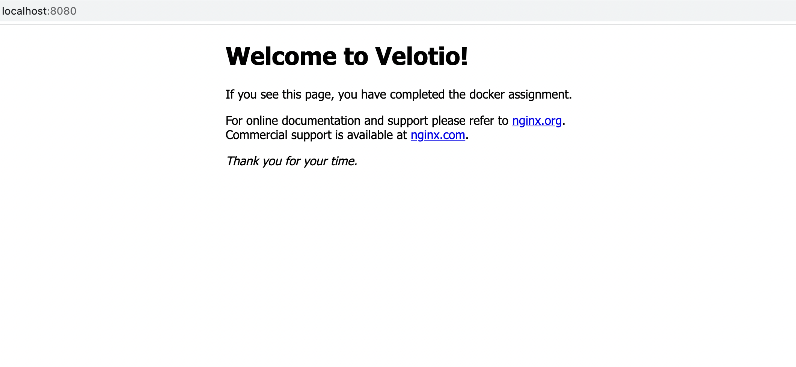

# Commands for the assignment

```docker
NGINX assignment:
1. docker run -it --rm -d -p 8080:80 --name web nginx
2. visit http://localhost:8080/
    
3. docker stop web
4. cd ~/
5. mkdir site-content
6. cd site-content
7. nano index.html & paste html code here
8. docker run -it --rm -d -p 8080:80 --name web -v ~/site-content:/usr/share/nginx/html nginx
9. visit http://localhost:8080/
   

MYSQL assignment:
1.  docker create -v /var/lib/mysql --name db-vol mysql
2.  docker run -d --name mysql-db-version-1 --volumes-from=db-vol -e MYSQL_ROOT_PASSWORD=password -p 3307:3306 mysql
3.  docker exec -it mysql-db-version-1 mysql -uroot -p
4.  CREATE DATABASE testDB;
5.  USE testDB;
6.  run below query in mysql shell client:-
    create table tblEmployee
    (
    Employee_id int auto_increment primary key,
    Employee_first_name varchar(500) NOT null,
    Employee_last_name varchar(500) NOT null,
    );
7.  INSERT INTO tblemployee (employee_first_name, employee_last_name) values ('Virat','Kohli')
8.  select * from tblEmployee;
9.  docker container stop [container_id of mysql-db-version-1]
10. docker container rm [container_id of mysql-db-version-1]     
11. docker run -d --name mysql-db-version-2 --volumes-from=db-vol -e MYSQL_ROOT_PASSWORD=password -p 3308:3306 mysql
12. docker exec -it mysql-db-version-2 mysql -uroot -p
13. select * from tblEmployee;
```

# Docker Image
- Docker hub image link - https://hub.docker.com/repository/docker/hemantkoli/go-app
